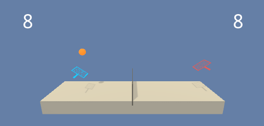
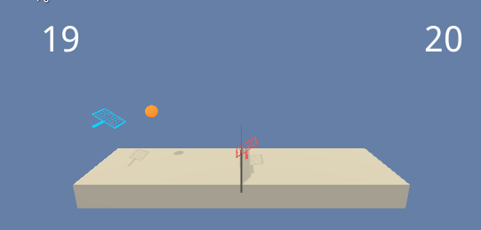

# Deep Reinforcement Learning - Collaboration and Competition

### Introduction

This project solves the [Tennis](https://github.com/Unity-Technologies/ml-agents/blob/master/docs/Learning-Environment-Examples.md#tennis) environment.

**Random Agent**



**Trained Agent**




In this environment, two agents control rackets to bounce a ball over a net. If an agent hits the ball over the net, it receives a reward of +0.1.  If an agent lets a ball hit the ground or hits the ball out of bounds, it receives a reward of -0.01.  Thus, the goal of each agent is to keep the ball in play.

The observation space consists of 8 variables corresponding to the position and velocity of the ball and racket. Each agent receives its own, local observation.  Two continuous actions are available, corresponding to movement toward (or away from) the net, and jumping. 

### Solving the environment

The task is episodic, and in order to solve the environment, your agents must get an average score of +0.5 (over 100 consecutive episodes, after taking the maximum over both agents). Specifically,

- After each episode, we add up the rewards that each agent received (without discounting), to get a score for each agent. This yields 2 (potentially different) scores. We then take the maximum of these 2 scores.
- This yields a single **score** for each episode.

The environment is considered solved, when the average (over 100 episodes) of those **scores** is at least +0.5.

### Getting Started

The repository contains a Python package `drl_cc` that has command line interface to show
a demo with a trained agent or to use a Random agent. 

**Important Notice:**
The DDPG agent was trained with using PyTorch 1.4.0 (due to need for CUDA10 to use local GPU).
However, the version `unityagents` is 0.4.0. Both `pytorch` and `unityagents` packages are required,
but were omitted from requirements in `setup.py` to prevent installation from PyPi.

To run the trained or random agent, clone this repository with `git` install with `pip` as usual:

```shell script
git clone https://github.com/daraliu/drl-collab-compet
pip install -e drl-collab-compet
```

1. Download the environment from one of the links below that matches your operating system:
    - Linux: [click here](https://s3-us-west-1.amazonaws.com/udacity-drlnd/P3/Tennis/Tennis_Linux.zip)
    - Mac OSX: [click here](https://s3-us-west-1.amazonaws.com/udacity-drlnd/P3/Tennis/Tennis.app.zip)
    - Windows (32-bit): [click here](https://s3-us-west-1.amazonaws.com/udacity-drlnd/P3/Tennis/Tennis_Windows_x86.zip)
    - Windows (64-bit): [click here](https://s3-us-west-1.amazonaws.com/udacity-drlnd/P3/Tennis/Tennis_Windows_x86_64.zip)
    
    (_For Windows users_) Check out [this link](https://support.microsoft.com/en-us/help/827218/how-to-determine-whether-a-computer-is-running-a-32-bit-version-or-64) if you need help with determining if your computer is running a 32-bit version or 64-bit version of the Windows operating system.

    (_For AWS_) If you'd like to train the agent on AWS (and have not [enabled a virtual screen](https://github.com/Unity-Technologies/ml-agents/blob/master/docs/Training-on-Amazon-Web-Service.md)), then please use [this link](https://s3-us-west-1.amazonaws.com/udacity-drlnd/P3/Tennis/Tennis_Linux_NoVis.zip) to obtain the "headless" version of the environment.  You will **not** be able to watch the agent without enabling a virtual screen, but you will be able to train the agent.  (_To watch the agent, you should follow the instructions to [enable a virtual screen](https://github.com/Unity-Technologies/ml-agents/blob/master/docs/Training-on-Amazon-Web-Service.md), and then download the environment for the **Linux** operating system above._)

2. Place the file in the root directory of this repository and unzip (or decompress) it. 


### Instructions

 
The path to a binary in the extracted environment has to be provided in [Tennis-training.ipynb](https://github.com/daraliu/drl-collab-compet/blob/master/notebooks/Tennis-training.ipynb) Jupyter notebook for training
and as a command line option if using the `drl-cc demo-tennis` command.

### Training

The agent final agent is trained using [Tennis-training.ipynb](https://github.com/daraliu/drl-collab-compet/blob/master/notebooks/Tennis-training.ipynb) Jupyter notebook which contains the best hyper parameters found during hyper parameter tuning.

The notebook [Tennis-DDPG-tuning.ipynb](https://github.com/daraliu/drl-collab-compet/blob/master/notebooks/Tennis-DDPG-tuning.ipynb) contains raw results from hyper parameter tuning and 
the notebook [Tennis-tuning-summary.ipynb](https://github.com/daraliu/drl-collab-compet/blob/master/notebooks/Tennis-tuning-summary.ipynb) summarized hyper parameter tuning results.

The detailed report on the approach is provided [here](https://github.com/daraliu/drl-collab-compet/blob/master/Report.md).

### Demo

Once the package is installed, `drl-cc` command group becomes available with
the command `demo-tennis` to run a demo with trained of Random agent.

```
» drl-cc demo-tennis --help
Usage: drl-cc demo-tennis [OPTIONS] [DIR_MODEL]

  Run a demo of Tennis agents - trained or random (if no model provided)

Options:
  -e, --unity-tennis-env FILE  Path to Unity Tennis Environment executable

  --help                       Show this message and exit.
```

Trained model weights located `training_output/best_agent/weights_actor.pth` and 
`training_output/best_agent/weights_critic.pth` after cloning the repository. 
Whe running the demo through command line interface, the directory `training_output/best_agent` 
should be provided as `DIR_MODEL`.
